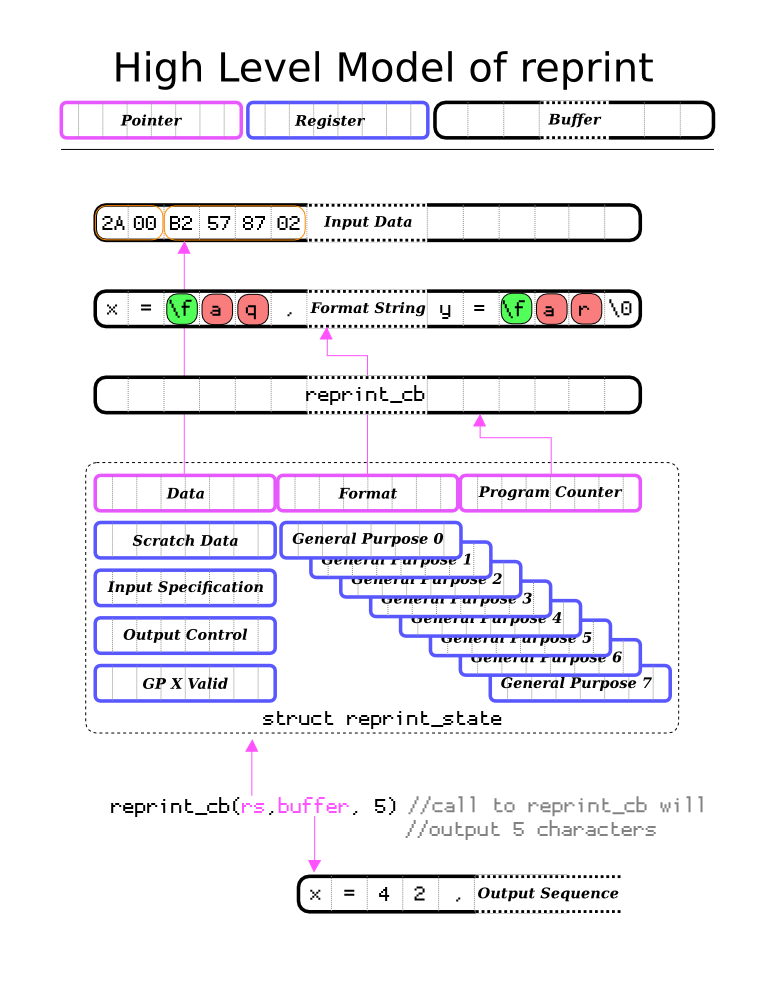
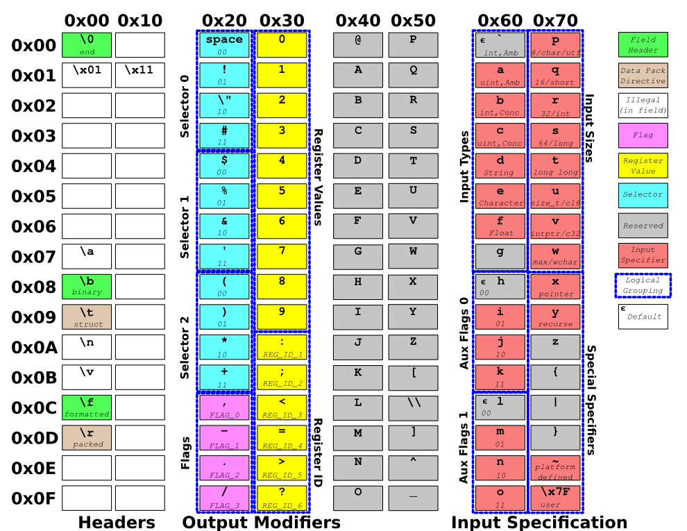

# reprint: redesigned printf #
### Specification version: 0.1.2 ###

reprint is a fresh approach to the semantics and syntax of formatted I/O.

Description
---------

While printf couples string formatting and data output, reprint considers these distinct operations. Developers should be able to specify the formatting and data needed for an operation, while a separate process can find buffer space for the output. reprint allows a developer to "pull" output characters from an initialized `struct reprint_state`.

Semantics
---------
 * **Data Marshalling**: printf constrains the user to marshall the input data on the stack, using stdargs. reprint allows the user pass a single pointer to tightly packed or struct padded data.
 * **Output buffering**: printf only outputs data into string buffers. reprint exposes its internal callback, `reprint_cb`, allowing the user to "pull" output byte by byte.
 * **Format string**: Like printf, reprint format strings are a mixture of unformatted characters and *conversion specifiers*. There are two types of conversion specifiers: *formatted* translates data into human readable text and *binary* converts to a binary format.
 * **Interpreter**: Any sophisticated output formatting engine is a mini virtual machine. The user controls reprint output by setting flags and register values, much like a microprocessor peripheral.

Syntax
------
 * **Arrangment**: The conversion specifier syntax is derived from the structure of the ASCII table. See the reprint syntax diagram.
 * **Field Header**: Indicates start of conversion specifier. The `\f` header starts a formatted specifier. The `\b` header starts a binary specifier.
 * **Modifiers**: Parameters that control the conversion behaviour. There are 4 flags, 3 2-bit selector registers, and 7 full registers of a platform dependent size. For each register, there is a corresponding DEFINED flag, which is set if the user specified a register value. Full register values are either passed in the data or specified in decimal or octal immediately preceding the register symbol.
 * **Input Specifier**: Every conversion specifier ends with exactly one input specifier. The input specifier identifies the type of data to be converted. The combination of the Field Header and the Input Specifier determine the function of the Modifiers. There are 64 possible input specifiers.

reprint symbols
---------------
The symbols comprising the syntax are carefully organized around the structure of their radix 2 representation.

 * For field headers, the third LSB toggles formatted vs binary.
 * Selector values are determined by the the first 2 LSB of the symbol value.
 * Flag symbols index the corresponding flag as determined by the the first 2 LSB of the symbol value.
 * Register symbols are in the same column as the digits. The register is identified by subtracting 0x39 from the register symbol value. Register 0 is set by the digits preceding the input specifier.

# reprint modifiers #

Organizing the symbol syntax around radix 2 means the modifiers are succintly identified in the following truth table

Modifiers: Selectors
-------------------------

 * **Rounding Method** (Selector0): Select which rounding method to use when a quantitative value is formatted.
     * 'unset' : round to even.
     * `00` : Round down
     * `01` : Round up
     * `10` : Round away from zero 
     * `11` : Round toward zero

 * **Output Radix** (Selector1): Format quantitative value in the following radix
     * 'unset' : Decimal
     * `00` : Hexadecimal
     * `01` : Octal
     * `10` : Radix 2
     * `11` : Reserved

 * **Prefix Select** (Selector2): Add the following prefixes to the output number
     * 'unset' : same as `00`
     * `00` : Print sign if negative `'-'`
     * `01` : Force sign output `'+'` or `'-'`
     * `10` : Print radix prefix (`0x` for hex, `0` for octal, `b` for binary)
     * `11` : Print radix prefix and force sign output

 * **Endian Select** (Selector0): Change the data endianess in output
     * 'unset' : Host endian
     * `00` : Little endian
     * `01` : Big endian
     * `10` : Reserved
     * `11` : Reserved

 * **Integer Output Format** (Selector1): Change the binary representation of the integer
     * 'unset': 2's complement (no change)
     * `00` : Sign magnitude
     * `01` : BCD, Binary coded decimal
     * `10` : DPD, Densely packed decimal
     * `11` : Reserved

 * **Pointer Load** (Selector0): Load pointer value into interpreter state; if loaded pointer value is null, then output stops immediately.
     * 'unset': Print only; do not load pointer
     * `00` : Print and load pointer into data pointer
     * `01` : Print and load pointer into format pointer
     * `10` : Load pointer into data pointer; do not print
     * `11` : Load pointer into format pointer; do not print

 * **Offset Calculation** (Selector2): Modify pointer value by an offset; offset value is whatever value remains in loaded data
     * 'unset': Do not modify pointer value.
     * `00` : Multiply offset by SIZE register and subtract from pointer
     * `01` : Bit shift offset by SIZE register and subtract from pointer
     * `10` : Multiply offset by SIZE register and add to pointer
     * `11` : Bit shift offset by SIZE register and add to pointer

Modifiers: Flags
-------------------------

 * **Right Align** (Flag 0): When printing formatted data, place padding on left data to align data chars on the right hand side.
 * **Expo Form** (Flag 2): When printing a formatted quantity, print in exponential (ie scientific) notation. This will write integers as well as floats in exponential format.
 * **Base 2** (Flag 2): When formatting a pointer value, print its numerical representation in base 2 instead of hexadecimal.
 * **Bit MSB** (Flag 3): When printing bit fields, apply Drop and Count to the MSB instead of the LSB.

Modifiers: Registers
-------------------------

 * **Field Width** (Register 0): If length of formatted data is less than the field width, add pad characters after the data until the field width is reached. The pad is generally the space `' '` character by default, except quantity values default to `'0'`.
 * **Pad Char** (Register 1): Override the default pad character.
 * **Shift** (Register 3): When printing a formatted quantity, shift the decimal point to the left. For integers, this results in fixed point printing. This has no effect when the Expo Form flag is set.
 * **Significant Figures** (Register 4): Limit the number of significant digits in the output and replace all omitted digits with zeroes if they are on the left hand side of the decimal point. Applies the Rounding Method.
 * **Precision** (Register 5): Print the specified number of digits after the decimal point. Either adds zero pads or uses the Rounding Method to round the output. Currently has no effect when the Expo Form flag is not set, but this could change.
 * **Bit Count** (Register 5): When printing Bits, print this number of MSB bits.
 * **Bit Drop** (Register 3): Before printing Bits, remove this number of MSB bits.
 * **String Length** (Register 2): Only print the specified number of characters in the string.
 * **String Start** (Register 3): Start printing from an offset in the string.
 * **Repeat** (Register 2): Print out the character n more times, where n is the register value.
 * **Size** (Register 3): Input to the pointer offset calculation.

Input Specifiers: 
-------------------------

Input specifiers describe the type of data for reprint to process.
At the most raw level, the input specifier is a combination of 11 bits:

 * **Specifier** 0x70-0x7F: Lower 4 bits are contributed from the terminating specifier.
 * **Type** 0x60-0x67: Lower 3 bits are contributed from the input type.
 * **Aux Flags 0** 0x68-0x6B: Lower 2 bits are contributed from the aux flags 0.
 * **Aux Flags 1** 0x6C-0x6F: Lower 2 bits are contributed from the aux flags 1.

reprint aims to cover as many kinds of input as possible, but satisfying all situations is impossible.
Consequently, there are 3 types of input specifiers:

 * **reprint standard** 0x70-0x7D : Defined by the reprint specification; input 
 * **reprint implementation** 0x7E : Defined by the reprint implementation; integrated as part of the reprint library build at compile time.
 * **user defined** 0x7F : Defined by the user; exact mechanism to be defined but most likely will trigger a user callback with reprint state.

All reprint implementations must be consistent with the reprint standard specifiers (within platform integer limits).
However, as seen with printf, divergence will always be a problem.
The reprint specification contains the divergence issue by defining the implementation defined and user specifiers, which give freedom for extensibility.
Any sufficiently important and globally applicable implementation defined specifiers could eventually be integrated into a future reprint specification as well.

printf Comparison
--------

Printing an integer:

	int k = 5;

	/* Using reprint */
	reprintf("The value is \fr\n", k);

	/* Using printf */
	printf("The value is %i\n", k);

Printing an integer and a string:

	const char STRING[] = "This is a test string";

	/* Using reprint */
	reprintf("The string is \fdp and the int is \fr\n", STRING, k);

	/* Using printf */
	printf("The string is %s and the int is %i\n", STRING, k);

Printing an array of 3 floats:

	float vector[3] = {1.0, 2.0, 3.0};

	/* Using reprint_ptr to print packed float data. */
	reprintf_ptr("Position at [\f\rfr,\ffr,\ffr]\n", vector);

	/* Using printf */
	printf("Position at [%f,%f,%f]\n", vector[0], vector[1], vector[2]);

Printing a struct:

	struct S {
		uint16_t first_number;
		uint8_t something;
		uint8_t something_else;
		int32_t big_number;
		char* string;
	} our_fine_struct;

	/* Use reprintf_ptr since we will not marshall data with va_args. */
	reprintf_ptr("\fcq \fcp \fcp \fbr \fdp\n", &our_fine_struct);

	/* Using printf. Curse the long variable name. */
	printf("%hu %hhu %hhu %i %s\n"
		,our_fine_struct.first_number
		,our_fine_struct.something
		,our_fine_struct.something_else
		,our_fine_struct.big_number
		,our_fine_struct.string);

Printing an <a href="http://en.wikipedia.org/wiki/IPv4#Header">IPV4 header:</a>

	uint8_t *incoming_packet;

	/* Using reprint. */
	/* \f\r0=cq pulls 16 bits without printing them.
		\fN;ncw prints N bits of data from this pool (in decimal by default).  */
	const char test_reprint_ipv4[] = 
		"\f\r0=cq"
		"Version:           \f4;ncw\n"
		"Header Words:      \f4;ncw\n"
		"DSCP:              \f6;ncw\n"
		"ECN:               \f2;cw\n"
		"Total Bytes:       \fcnq\n"
		"Identification:    \fcnq\n"
		"\f0=cq"
		"Flags:             \f&3;ncw\n"
		"Fragment Offset:   \f13;cw\n"
		"Protocol:          \fcp\n"
		"TTL:               \fcp\n"
		"Header Checksum:   \fcnq\n"
		"Source IP:         \fcp.\fcp.\fcp.\fcp\n"
		"Dest IP:           \fcp.\fcp.\fcp.\fcp\n";

	reprintf_ptr(test_reprint_ipv4, incoming_packet);

	/* Using printf. The format string may appear simpler, but correctly extracting
	the data from the packet just to put it on the stack is a painful task.
	I'm not even sure if that part is right... */
	const char test_printf_ipv4[] = 
		"Version:           %u\n"
		"Header Words:      %u\n"
		"DSCP:              %u\n"
		"ECN:               %u\n"
		"Total Bytes:       %u\n"
		"Identification:    %u\n"
		"Flags:             %x\n"
		"Fragment Offset:   %u\n"
		"Protocol:          %u\n"
		"TTL:               %u\n"
		"Header Checksum:   %u\n"
		"Source IP:         %u.%u.%u.%u\n"
		"Dest IP:           %u.%u.%u.%u\n";

	printf(test_printf_ipv4
		,incoming_packet[0] >> 4
		,incoming_packet[0] & 0xF
		,incoming_packet[1] >> 2
		,incoming_packet[1] & 0x3
		,*(uint16_t*)(incoming_packet + 2)
		,*(uint16_t*)(incoming_packet + 4)
		,incoming_packet[5] >> 5
		,*(uint16_t*)(incoming_packet + 6) & 0x1FFF
		,incoming_packet[8]
		,incoming_packet[9]
		,*(uint16_t*)(incoming_packet + 10)
		,incoming_packet[12]
		,incoming_packet[13]
		,incoming_packet[14]
		,incoming_packet[15]
		,incoming_packet[16]
		,incoming_packet[17]
		,incoming_packet[18]
		,incoming_packet[19]);

Print three structs in a row:

	Struct1 s1;
	Struct2 s2;
	Struct3 s3;

	/* Using reprint. */
	const char struct1f[] = "\f...\fjy";
	const char struct2f[] = "\f...\fjy";
	const char struct3f[] = "\f...";

	reprintf(struct1f, &s1, struct2f, &s2, struct3f, &s3);

	/* Using printf. */

	printf("slkdf", ....);
	printf("slkdf", ....);
	printf("slkdf", ....);

Requirements
------------

 * Compiler must support Labels as variables; gcc and llvm do this
 * Most platforms will require endian.h for endian translation
